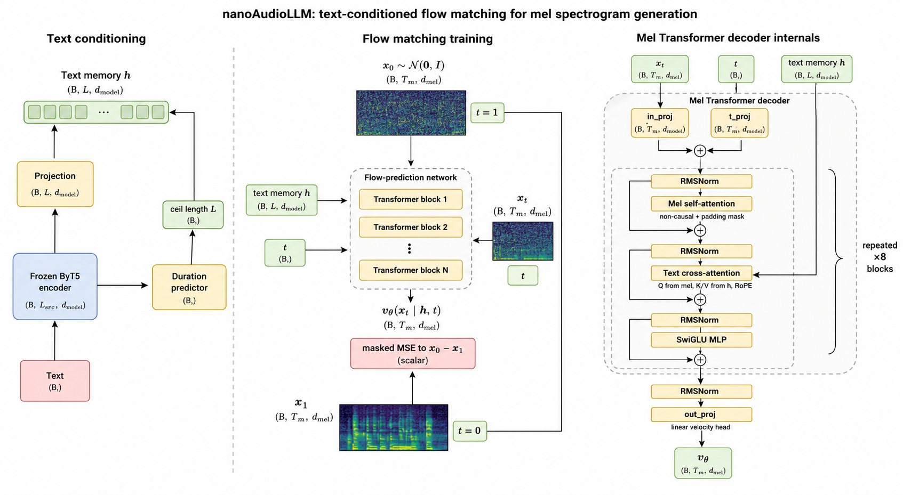

# nanoAudioLLM

Small LJSpeech text-to-speech research scaffold using frozen ByT5 text conditioning, a Transformer mel flow decoder, and BigVGAN-compatible log-mel spectrograms.

The goal is to provide a somewhat realistic audio diffusion setup that is still small enough to inspect, modify, overfit, and debug quickly. The project is inspired by [KellerJordan/modded-nanogpt](https://github.com/KellerJordan/modded-nanogpt): keep the core training path plain, make experiments easy to run, and prefer measurable iteration over framework-heavy structure.

Most of the implementation work in this repo was done with OpenAI Codex as the coding agent.

## Core Design

- Dataset: LJSpeech only for this release, so iteration stays small, single-speaker, and easy to overfit before larger corpora are reintroduced.
- Text encoder: frozen `google/byt5-small`; only the projection into the mel decoder is trained on the text side.
- Mel representation: BigVGAN-compatible log-mel spectrograms, normalized with corpus statistics before flow matching and denormalized before vocoding.
- Decoder: Transformer mel decoder with non-causal mel self-attention, RoPE-applied text cross-attention over projected ByT5 hidden states, RMSNorm residual blocks, and continuous log-mel flow prediction.
- Duration predictor: the same model includes a trainable duration predictor on pooled text features; it predicts log audio duration and sampling uses that duration to choose the generated mel length.
- Tail silence: the data loader appends random trailing silence with probability `silence_prob`, up to `max_silence_sec`, so the duration predictor learns that text duration can include a short end pause.
- Timestep schedule: logit-normal timestep sampling during training, controlled by `timestep_logit_mean` and `timestep_logit_std` in config.
- Sampling: simple Euler integration with CFG and BigVGAN-compatible mel output.



## Code Map

Runtime files:

- `audio.py`: BigVGAN-compatible log-mel extraction plus log-mel normalize/denormalize helpers.
- `config.py`: `TrainConfig` and YAML config loading for model, data, optimizer, eval, and audio settings.
- `data.py`: memmap/parquet LJSpeech dataset readers, text lookup, tail-silence augmentation, padding, and batch collation.
- `evaluator.py`: lightweight in-training sampler, BigVGAN vocoding, Whisper WER, and eval artifact writing.
- `metric.py`: local JSONL/W&B metric logger used by the training loop.
- `model.py`: frozen text encoder wrapper, duration predictor, Transformer mel decoder, attention blocks, flow-matching loss, and parameter accounting.
- `sample.py`: single-prompt checkpoint sampling with duration prediction, Euler CFG, denormalization, and BigVGAN output.
- `train.py`: DDP training entrypoint, optimizer setup, gradient accumulation, checkpointing, logging, and periodic eval.

Training artifacts, checkpoints, plots, generated samples, and eval outputs are written under `.artifacts/`.

## Data

The release dataset is LJSpeech, a single-speaker English speech dataset, processed under `data/ljspeech_bigvgan`. Dataset statistics live in `data/ljspeech_bigvgan/metadata/dataset_stats.json` and include corpus log-mel mean/std, sample count, duration, frame count, and ByT5 token statistics.

## Train

Run the main 2-GPU training job:

```bash
./run.sh
```

Override GPU count and per-process batch size:

```bash
./run.sh --gpus 1 --batch_size 32
BATCH_SIZE=64 NUM_GPUS=2 ./run.sh
```

W&B is enabled by default in local offline mode. Point it at a local W&B server when needed:

```bash
./run.sh --wandb-url http://localhost:8080
```

Run the 64-sample overfit test:

```bash
CUDA_VISIBLE_DEVICES=0 .venv/bin/python train.py \
  --config configs/ljspeech_overfit64.yaml
```

The overfit config uses `eval_prompts: overfit`, so WER prompts are read dynamically from the first 64 LJSpeech samples in `data_dir`.

Run lightweight in-loop eval every 1000 steps on a deterministic 64-prompt sample from `eval/libritts_samples.txt`:

```bash
./run.sh
```

Eval writes wavs and `wer.jsonl` under `<out_dir>/eval/step_*` and logs `eval/wer` into `metrics.jsonl`. Whisper uses CUDA by default; use `--eval_whisper_device cpu` only when it must not share training GPU memory.

## Sample

```bash
.venv/bin/python sample.py \
  --ckpt .artifacts/local/ljspeech_byt5_flow_matching_200k/latest.pt \
  --text "Hi, how are you?" \
  --steps 50 \
  --cfg_scale 2.0 \
  --out .artifacts/local/sample.wav
```

## Eval

Use the project TTS research skill for the overfit-first workflow, monitoring, and full WER evaluation.
